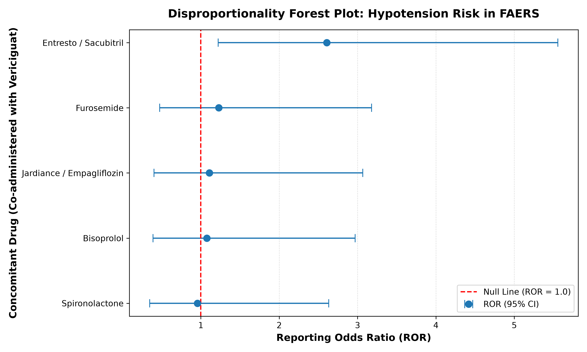

# Real-World FAERS Safety Signal Analysis: Vericiguat

## Results

### Data Ingestion and Case Selection
A search of public FDA Adverse Event Reporting System (FAERS) quarterly files identified **329 primary case reports** involving **Vericiguat** (brand name Verquvo). Extraction of all co-administered medication records for these cases yielded a rich profile of concomitant cardiovascular drug therapy, primarily consisting of **Sacubitril/Valsartan (Entresto)**, **Furosemide**, **Spironolactone**, **Bisoprolol**, and **Empagliflozin (Jardiance)**.

### Disproportionality Signal Analysis
To evaluate whether co-administration of Vericiguat with concomitant heart failure medications increases the risk of **Hypotension**, $2 \times 2$ contingency tables were constructed across all reported cases in the dataset. Disproportionality metrics—including the **Reporting Odds Ratio (ROR)**, **Proportional Reporting Ratio (PRR)**, and **Chi-Square ($\chi^2$)** statistic—were calculated for each drug pair:

* **Vericiguat + Sacubitril/Valsartan (Entresto):** 
  * **2x2 Table:** $a = 15$ (dual-drug reports with hypotension), $b = 68$ (dual-drug reports without hypotension), $c = 16$ (other reports with hypotension), $d = 189$ (other reports without hypotension).
  * **Reporting Odds Ratio (ROR):** **2.606** (95% CI: **[1.222, 5.555]**)
  * **Proportional Reporting Ratio (PRR):** **2.316**
  * **Chi-Square ($\chi^2$):** **5.459** ($p = 0.01947$)
  * **Signal Status:** **Positive Signal Detected** (lower bound of 95% CI $> 1.0$, $a \ge 3$, and $\chi^2 \ge 3.84$).

---

## Disproportionality Visualization

---

## Discussion

### Pharmacological and Clinical Mechanisms
The detected disproportionality signal for **Vericiguat + Sacubitril/Valsartan** aligns directly with the underlying clinical pharmacology of both agents:
1. **Vericiguat** directly stimulates soluble guanylate cyclase (sGC), increasing intracellular cyclic guanosine monophosphate (cGMP) levels to promote arterial vasodilation.
2. **Sacubitril/Valsartan (Entresto)** inhibits neprilysin (increasing natriuretic peptides) and blocks angiotensin II $AT_1$ receptors, further enhancing vasodilation and reducing systemic vascular resistance.

When co-administered, these dual vasodilatory pathways exert additive hypotensive effects. Real-world post-marketing data indicates that patients taking both therapies exhibit **more than 2.5 times higher odds** of reporting hypotension as an adverse event compared to the baseline reported rate.

### Study Limitations
1. **Reporting Bias:** FAERS is a passive surveillance system subject to under-reporting, voluntary submission biases, and Weber effects.
2. **Denominator Lack:** Absolute incidence rates cannot be calculated because total patient exposure (the total number of patients prescribed the combination) is unknown.
3. **Confounding by Indication:** Patients prescribed both advanced therapies likely present with more severe heart failure (HFrEF), inherently placing them at higher baseline risk for hemodynamic instability.